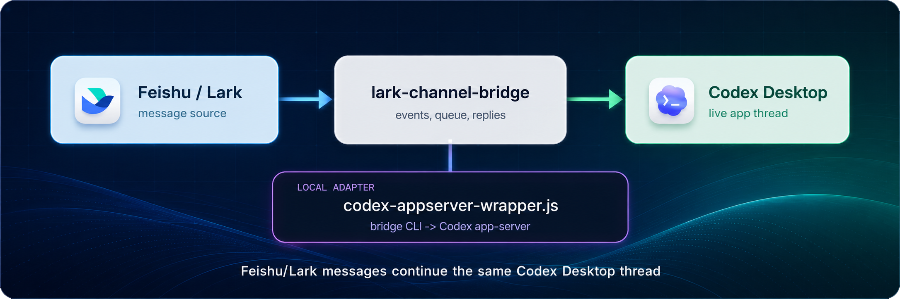
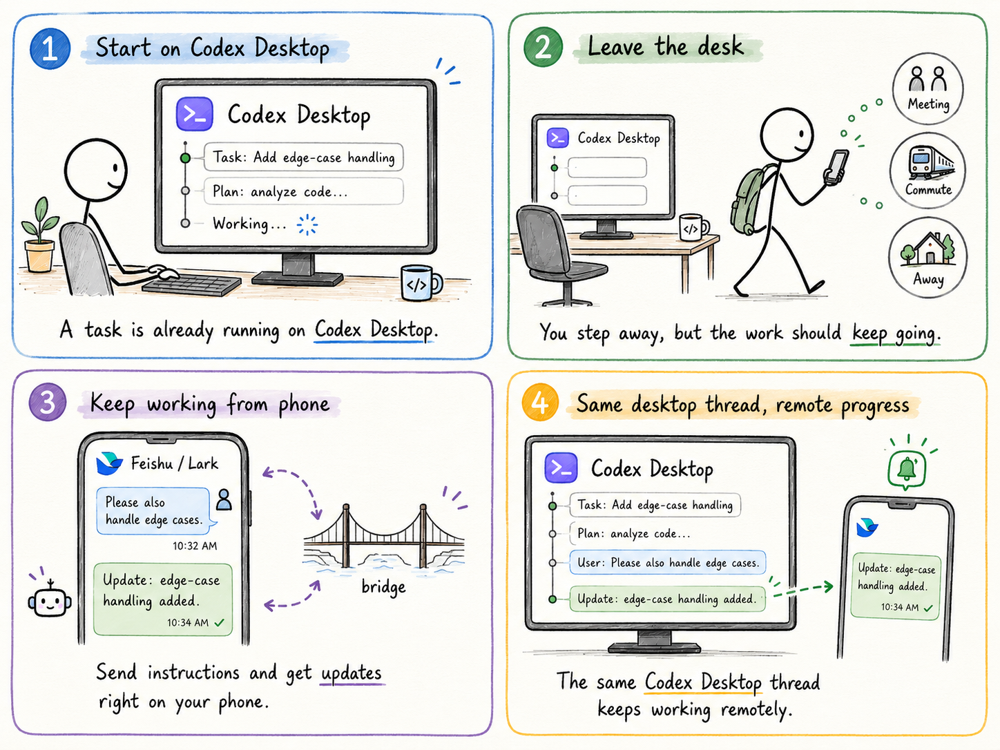

<h1 align="center">Lark Codex Desktop Bridge</h1>

<p align="center">
  <a href="README.zh-CN.md">中文说明</a>
</p>

<p align="center">
  
</p>

<p align="center">
  
  
  
  
</p>

## Use Case

<p align="left">
  
</p>

Keep the same Codex Desktop thread going, and continue it seamlessly from Feishu/Lark. On the road, in an elevator, or anywhere you only have your phone, you can keep the conversation moving while the desktop thread stays in sync.

## Architecture

```text
Feishu/Lark message
  -> lark-channel-bridge
  -> codex-appserver-wrapper.js
  -> Codex app-server
  -> Codex Desktop/App thread
```

## Repository Layout

```text
skills/lark-codex-desktop-bridge/
  SKILL.md                         Codex skill instructions
  agents/openai.yaml               Codex skill UI metadata
  scripts/bootstrap_dependencies.js dependency checker/installer
  scripts/setup_lark_codex_desktop_bridge.js desktop-thread setup script
```

`agents/openai.yaml` is not a Feishu/Lark or bridge runtime config. It is metadata used by Codex to show the skill name, short description, and default prompt in the UI.

## Prerequisites

- Node.js and npm
- Codex Desktop or Codex CLI
- `lark-channel-bridge` <https://github.com/zarazhangrui/feishu-claude-code-bridge>
- `lark-cli` from `@larksuite/cli`
- A working Feishu/Lark bot app profile in `lark-channel-bridge`

The Feishu/Lark bot profile must already receive and reply to normal messages before this bridge is applied.

## Install The Skill

On macOS/Linux, run this from the repository root to copy the skill into the default Codex skills directory:

```bash
mkdir -p ~/.codex/skills
cp -R skills/lark-codex-desktop-bridge ~/.codex/skills/
```

If you use a custom `CODEX_HOME`, replace `~/.codex` in this and later commands with your `CODEX_HOME` path.

Then restart Codex so the skill is discoverable.

## Bootstrap Dependencies

Check dependencies:

```bash
node ~/.codex/skills/lark-codex-desktop-bridge/scripts/bootstrap_dependencies.js
```

Install missing npm dependencies only when you explicitly want the script to do so:

```bash
node ~/.codex/skills/lark-codex-desktop-bridge/scripts/bootstrap_dependencies.js --install
```

This runs:

```bash
npm install -g lark-channel-bridge @larksuite/cli
```

## Setup

First create and verify a normal `lark-channel-bridge` profile. The profile must be able to receive and reply to Feishu/Lark messages.

Then bind a Feishu/Lark chat to a Codex Desktop/App thread:

```bash
node ~/.codex/skills/lark-codex-desktop-bridge/scripts/setup_lark_codex_desktop_bridge.js \
  --profile codex \
  --chat-id <lark-chat-id> \
  --thread-id <codex-thread-id> \
  --cwd <workspace-directory>
```

The setup script:

- installs `~/.lark-channel/bin/codex-appserver-wrapper.js`
- updates `~/.lark-channel/config.json`
- writes `~/.lark-channel/profiles/<profile>/desktop-thread-map.json`
- updates an existing bridge session catalog entry when possible

Use `--restart` only from a normal shell, not from inside a currently running bridge-spawned agent process.

## Required Inputs

- `chat-id`: Feishu/Lark chat id. In bridge-delivered messages this is `bridge_context.chatId`.
- `thread-id`: Codex Desktop/App thread id.
- `profile`: lark-channel profile name, commonly `codex`.
- `cwd`: workspace directory used by the bridge session.

You do not need to provide app secrets to this setup script. App credentials stay in `lark-channel-bridge` / `lark-cli`.

## Verification

```bash
lark-channel-bridge status --profile codex
node --check ~/.lark-channel/bin/codex-appserver-wrapper.js
~/.lark-channel/bin/codex-appserver-wrapper.js --version
```

After sending a Feishu/Lark message, check bridge logs and confirm the run resumes the expected Codex thread id.

## Limitations

- This is a local adapter layer, not a built-in `lark-channel-bridge` mode.
- The wrapper depends on the current `lark-channel-bridge` Codex adapter command shape and Codex `app-server` protocol.
- Upgrading `lark-channel-bridge` or Codex may require rerunning setup and re-verifying the bridge.
- One chat/cwd binding maps to one Codex thread.

## License

MIT

## Acknowledgements

This project builds on [`lark-channel-bridge`](https://github.com/zarazhangrui/feishu-claude-code-bridge). That project owns Feishu/Lark message intake, queueing, replies, and the bridge runtime; this project only adds the Codex Desktop/App thread adapter.

Thanks also to Feishu/Lark Open Platform and [`@larksuite/cli`](https://github.com/larksuite/cli) for the open APIs and local CLI toolchain, and to Codex Desktop / Codex CLI for the desktop thread and app-server capabilities.
