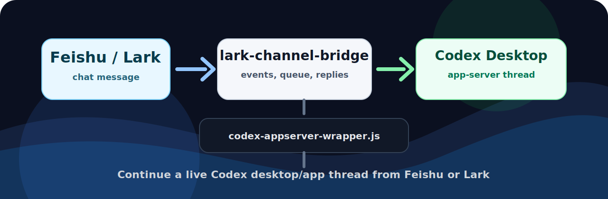

# Lark Codex Desktop Bridge

[English README](README.md)

<p align="center">
  
</p>

<p align="center">
  <a href="https://github.com/zarazhangrui/feishu-claude-code-bridge"></a>
  
  
  
</p>

把 Codex 桌面端/App 线程接进飞书/Lark，并使用 [`lark-channel-bridge`](https://github.com/zarazhangrui/feishu-claude-code-bridge) 作为消息桥。

这个仓库包含一个 Codex skill 和配套脚本。它不替代 `lark-channel-bridge`，而是在最后一跳加一个本地 wrapper：把原本的 `codex exec` 调用改成 Codex `app-server` 的 `thread/resume + turn/start`，从而让飞书/Lark 消息进入正在使用的 Codex 桌面线程。

## 架构

```text
飞书/Lark 消息
  -> lark-channel-bridge
  -> codex-appserver-wrapper.js
  -> Codex app-server
  -> Codex 桌面端/App 线程
```

## 依赖关系

本项目把 `lark-channel-bridge` 作为外部运行时依赖。

`lark-channel-bridge` 是 npm 包，对应原项目：

<https://github.com/zarazhangrui/feishu-claude-code-bridge>

本仓库不会把这个包的代码复制进来。skill 里的 bootstrap 脚本可以检查它是否存在；只有用户显式传 `--install` 时才会安装。

## 仓库结构

```text
skills/lark-codex-desktop-bridge/
  SKILL.md                         Codex skill 说明
  agents/openai.yaml               Codex skill 的 UI 元数据
  scripts/bootstrap_dependencies.js 依赖检查/安装脚本
  scripts/setup_lark_codex_desktop_bridge.js 桌面线程绑定脚本
```

`agents/openai.yaml` 不是飞书/Lark 或 bridge 的运行配置。它只是 Codex 用来展示 skill 名称、短描述和默认提示词的 UI 元数据。

## 前置条件

- Node.js 和 npm
- Codex Desktop 或 Codex CLI
- `lark-channel-bridge`
- 来自 `@larksuite/cli` 的 `lark-cli`
- 一个已经可用的 `lark-channel-bridge` 飞书/Lark 机器人 profile

在运行本项目的桌面线程绑定之前，飞书机器人必须已经能正常接收和回复普通消息。

## 安装 Skill

把 skill 复制到 Codex skills 目录：

```bash
mkdir -p ~/.codex/skills
cp -R skills/lark-codex-desktop-bridge ~/.codex/skills/
```

然后重启 Codex，让 skill 被识别。

## 检查/安装依赖

先只检查依赖：

```bash
node ~/.codex/skills/lark-codex-desktop-bridge/scripts/bootstrap_dependencies.js
```

只有明确希望脚本安装依赖时，才运行：

```bash
node ~/.codex/skills/lark-codex-desktop-bridge/scripts/bootstrap_dependencies.js --install
```

这会执行：

```bash
npm install -g lark-channel-bridge @larksuite/cli
```

## 配置

先创建并验证普通的 `lark-channel-bridge` profile。这个 profile 必须已经能收到飞书/Lark 消息，并能正常回复。

然后把某个飞书/Lark 会话绑定到一个 Codex 桌面线程：

```bash
node ~/.codex/skills/lark-codex-desktop-bridge/scripts/setup_lark_codex_desktop_bridge.js \
  --profile codex \
  --chat-id <lark-chat-id> \
  --thread-id <codex-thread-id> \
  --cwd <workspace-directory>
```

这个 setup 脚本会：

- 安装 `~/.lark-channel/bin/codex-appserver-wrapper.js`
- 更新 `~/.lark-channel/config.json`
- 写入 `~/.lark-channel/profiles/<profile>/desktop-thread-map.json`
- 如果已有 bridge session catalog，则尽量更新对应记录

`--restart` 只应在普通终端里使用，不要在当前由 bridge 拉起的 agent 进程里使用。

## 必要输入

- `chat-id`：飞书/Lark chat id。在 bridge 注入的消息里对应 `bridge_context.chatId`。
- `thread-id`：Codex 桌面端/App 线程 id。
- `profile`：lark-channel profile 名，通常是 `codex`。
- `cwd`：这个 bridge 会话使用的工作目录。

setup 脚本不需要 app secret。应用凭证继续由 `lark-channel-bridge` / `lark-cli` 管理。

## 验证

```bash
lark-channel-bridge status --profile codex
node --check ~/.lark-channel/bin/codex-appserver-wrapper.js
~/.lark-channel/bin/codex-appserver-wrapper.js --version
```

发送一条飞书/Lark 消息后，检查 bridge 日志，确认这次运行 resume 到了预期的 Codex thread id。

## 限制

- 这是一个本地适配层，不是 `lark-channel-bridge` 的内置模式。
- wrapper 依赖当前 `lark-channel-bridge` 的 Codex adapter 调用形态，也依赖 Codex `app-server` 协议。
- 升级 `lark-channel-bridge` 或 Codex 后，可能需要重新运行 setup 并重新验证。
- 一个 chat/cwd 绑定一个 Codex thread。

## License

MIT

## 致谢

本项目基于 [`lark-channel-bridge`](https://github.com/zarazhangrui/feishu-claude-code-bridge)。飞书/Lark 消息桥接由该包负责；本项目只补充 Codex 桌面端/App 线程适配层。
